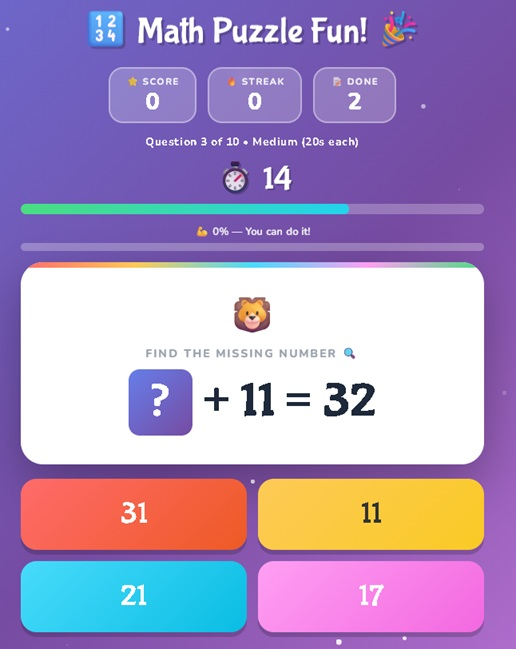

# 🔢 Math Puzzle Fun!

An interactive, client-side math puzzle web app designed for kids. No installation or backend required — just open the HTML file in any modern browser.

🌐 **Live Demo:** [https://thirukumaran13.github.io/math_puzzle_kids/math-puzzle-kids.html](https://thirukumaran13.github.io/math_puzzle_kids/math-puzzle-kids.html)

---

## Features

- **4-choice answer buttons** — tap the correct missing number
- **Operations** — Addition, Subtraction, Multiplication, Division
- **Mixed multi-term equations** — up to 4 terms with random +/− operators
- **Two game modes**
  - 🎮 Free Play — unlimited questions with 3-second auto-advance
  - ⏱️ Timed Mode — 10-question challenge with per-question countdown
- **Three difficulty levels** — Easy / Medium / Hard
- **Configurable settings** (right-side drawer)
  - Max number size: 1–4 digits
  - Max number of terms: 2–4
  - Enable Multiply / Divide operations
- **Sound effects** — correct, wrong, streak fanfare, tick, timeout, and rich Game Over summary music (Web Audio API, no external files)
- **Confetti** on streaks ≥ 3 and outstanding scores
- **Score, streak & accuracy** tracking with progress bar
- **Mute button** — top-right corner, also available in settings drawer
- **Kids-friendly UI** — animated mascot, colorful buttons, bubbly fonts, twinkling stars

---

## Usage

Open `math-puzzle-kids.html` directly in any modern browser — no server, no dependencies.

```
math-puzzle-kids.html   ← everything in one file
```

---

## Tech Stack

- Pure HTML5 / CSS3 / Vanilla JavaScript
- [Google Fonts](https://fonts.google.com/) — Bubblegum Sans, Nunito
- Web Audio API for sound effects (synthesized, no audio files)

---

## Screenshots



---

## License

MIT — free to use, share, and modify.
